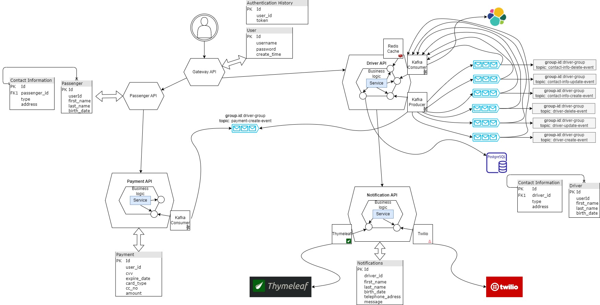

# Notification Service

[](https://sonarcloud.io/dashboard?id=semihshn_notification-service)
[](https://sonarcloud.io/dashboard?id=semihshn_notification-service)
[](https://sonarcloud.io/dashboard?id=semihshn_notification-service)
[](https://sonarcloud.io/dashboard?id=semihshn_notification-service)
[](https://sonarcloud.io/dashboard?id=semihshn_notification-service)

---

## Reports
* [Sonar Report](https://sonarcloud.io/dashboard?id=semihshn_notification-service)

---

# Diagram



# E-mail Notification
1. login to your gmail account where your app will send email
2. open two steps verification -> account -> security -> 2-Step Verification
3. under "2-Step Verification" , click on "App passwords"
4. then in "Select App" press "Other"
5. write a description in the open page and press genarate
6. in the open "Genarated App Password copy the created password and use it in your smpt password as usual password(Check you dont copy spaces) that it
7. Paste the smtp password you created in your application where it says <YOUR_KEY> in the application.properties file, so the value of the spring.mail.password property should be your smtp password
8. Perform the post operation by entering the relevant json information in the /api/notifications/email end-point
9. #### URI: http://localhost:8000/api/notifications/email
<span style="color:orange">POST</span>
```json
{
  "driverId":1,
  "firstName":"Test_name",
  "lastName":"Test_last_name",
  "birthDate":"2014-04-29",
  "mail":"semih.sahan.info@gmail.com",
  "message":"Test_message"
}
```
<hr/>